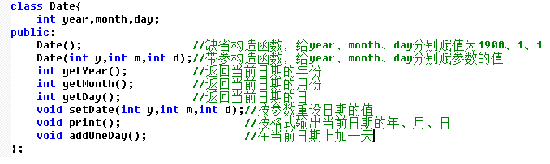

# 问题B: Date(类与对象)

## 题目描述

下面是一个日期类的定义，请在类外实现其所有的方法，并在主函数中生成对象测试之。



注意，在判断明天日期时，要加入跨月、跨年、闰年的判断

例如9.月30日的明天是10月1日，12月31日的明天是第二年的1月1日

2月28日的明天要区分是否闰年，闰年则是2月29日，非闰年则是3月1日

## 输入

测试数据的组数t

第一组测试数据的年 月 日

..........

要求第一个日期的年月日初始化采用构造函数，第二个日期的年月日初始化采用setDate方法，第三个日期又采用构造函数，第四个日期又采用setDate方法，以此类推。

## 输出

输出今天的日期

输出明天的日期

## 样例输入
```
4
2012 1 3
2012 2 28
2012 3 31
2012 4 30
```

## 样例输出
```
Today is 2012/01/03
Tomorrow is 2012/01/04
Today is 2012/02/28
Tomorrow is 2012/02/29
Today is 2012/03/31
Tomorrow is 2012/04/01
Today is 2012/04/30
Tomorrow is 2012/05/01
```

## 优秀代码示例
```C++
#include <iostream>
#include <iomanip>

using namespace std;

class Date {
private:
    int year, month, day;
public:
    Date();
    Date(int y, int m, int d);
    int getYear();
    int getMonth();
    int getDay();
    void setDate(int y, int m, int d);
    void print();
    void addOneDay();
};

Date::Date () {
    year = 1990;
    month = day = 1;
}

Date::Date (int y, int m, int d) {
    year = y;
    month = m;
    day = d;
}

int Date::getYear () {
    return year;
}

int Date::getMonth () {
    return month;
}

int Date::getDay () {
    return day;
}

void Date::setDate (int y, int m, int d) {
    year = y;
    month = m;
    day = d;
}

void Date::print () {
    cout << setfill('0') << setw(4) <<year << '/' << setw(2) << month << '/' << setw(2) << day;
}

void Date::addOneDay () {
    // 闰年的判断标识符
    bool leapYear = year % 400 || year % 100 && year % 4 == 0;
    // 保存每个月份的天数
    int monthTable[12] = {31, 28 + leapYear, 31, 30, 31, 30, 31, 31, 30, 31, 30, 31};
    day++;
    // 判断天数的溢出
    if (day > monthTable[month - 1]) {
        month++;
        day = 1;
    }
    // 判断月数的溢出
    if (month > 12) {
        year++;
        month = 1;
    }
}

int main () {
    int t;
    cin >> t;
    while(t--) {
        int y, m, d;
        cin >> y >> m >> d;
        Date p(y, m, d);
        cout << "Today is ";
        p.print();
        cout << endl;
        p.addOneDay();
        cout << "Tomorrow is ";
        p.print();
        cout << endl;
    }
    return 0;
}
```