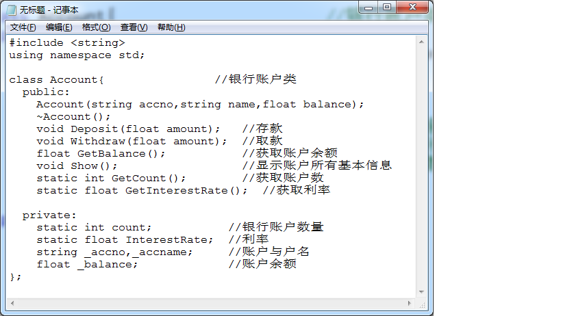

# 问题 B: 银行账户（静态成员与友元函数）

## 题目描述

银行账户类的基本描述如下：



要求如下：

实现该银行账户类

为账户类Account增加一个友元函数，实现账户结息，要求输出结息后的余额（结息余额=账户余额+账户余额*利率）。友元函数声明形式为 friend void Update(Account& a);

在main函数中，定义一个Account类型的指针数组，让每个指针指向动态分配的Account对象，并调用成员函数测试存款、取款、显示等函数，再调用友元函数测试进行结息。

大家可以根据实际需求在类内添加其他方法，也可以修改成员函数的参数设置

## 输入

第1行：利率
第2行：账户数目n
第3行开始，每行依次输入一个账户的“账号”、“姓名”、“余额”、存款数，取款数。

## 输出

第1行开始，每行输出一个账户的相关信息，包括账号、姓名、存款后的余额、存款后结息余额、取款后余额。

最后一行输出所有账户的余额。

## 样例输入
```
0.01
3
201501 张三 10000 1000 2000
201502 李四 20000 2000 4000
201503 王二 80000 4000 6000
```

## 样例输出
```
201501 张三 11000 11110 9110
201502 李四 22000 22220 18220
201503 王二 84000 84840 78840
106170
```

## 优秀代码示例
```C++
#include <iostream>
#include <string>

using namespace std;

// 银行账户类
class Account {
public:
    Account(string accno, string accname, float balance);
    ~Account();
    void Deposit(float amount);
    void Withdraw(float amount);
    float GetBalance();
    void Show();
    static int GetCount();
    static float GetInterestRate();
    static void SetInterestRate(float rate);
    friend void Update(Account &a);
private:
    static int count;
    static float InterestRate;
    string _accno, _accname;
    float _balance;
};

// 初始化静态成员
int Account::count = 0;
float Account::InterestRate = 0;

// 构造函数
Account::Account(string accno, string accname, float balance)
    :_accno(accno), _accname(accname), _balance(balance) {
    count++;
}

// 析构函数
Account::~Account() {
    count--;
}

// 存款
void Account::Deposit(float amount) {
    _balance += amount;
}

// 取款
void Account::Withdraw(float amount) {
    _balance -= amount;
}

// 获取余额
float Account::GetBalance() {
    return _balance;
}

// 输出基本信息
void Account::Show() {
    cout << _accno << ' ' << _accname << ' ' << _balance;
}

// 获取账户数量
int Account::GetCount() {
    return count;
}

// 获取利率
float Account::GetInterestRate() {
    return InterestRate;
}

// 设置利率
void Account::SetInterestRate(float rate) {
    InterestRate = rate;
}

// 友元结息函数
void Update(Account &a) {
    a._balance += a._balance * Account::InterestRate;
}

int main() {
    float rate, sum = 0;
    int count;
    cin >> rate >> count;
    // 设置利率
    Account::SetInterestRate(rate);
    // 按照题目要求建立一个指针数组
    Account **p = new Account*[count];
    for (int i = 0; i < count; i++) {
        string accno, accname;
        float balance, deposit, withdraw;
        cin >> accno >> accname >> balance >> deposit >> withdraw;
        // 实例化对象
        p[i] = new Account(accno, accname, balance);
        // 存款
        p[i]->Deposit(deposit);
        // 输出基本信息
        p[i]->Show();
        // 结息
        Update(*p[i]);
        cout << ' ' << p[i]->GetBalance();
        // 取款
        p[i]->Withdraw(withdraw);
        cout << ' ' << p[i]->GetBalance() << endl;
        sum += p[i]->GetBalance();
        delete p[i];
    }
    cout << sum << endl;
    delete []p;
    return 0;
}
```
