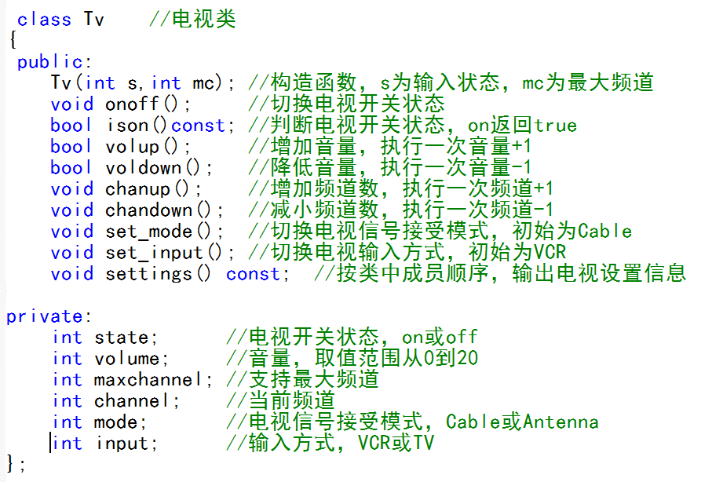
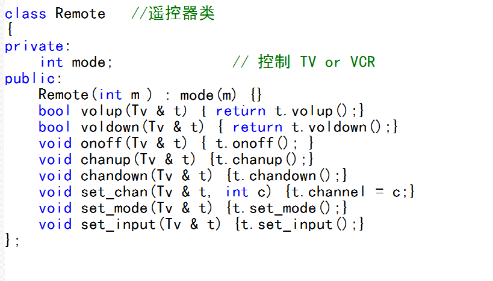

# 问题 C: 电视机与遥控器（友元类）

## 题目描述

有如下的电视类和遥控器类，遥控器可以控制电视。




要求如下：
1. 实现并完善Tv类；
2. 将Remote设为Tv的友元类，以支持在Remote类中对Tv方法的调用。
3. 在main函数中，通过Remote实例对TV实例进行操作。

## 输入

第一行，电视初始状态，依次为state,volume,channel,mode,input的初始值。
第二行，利用遥控器对上述状态的操作指令，用对应的函数名表示，如增加音量为volup

## 输出

第一行，执行遥控器操作后的状态。

## 样例输入
```
off 10 20 Cable VCR
onoff volup chanup set_mode set_input
```

## 样例输出
```
on 11 21 Antenna TV
```

## 优秀代码示例
```C++
/*
 * 这道题目出的比较糟糕- -
 * 要求模糊，定义不清
 * 所以我在原有的基础上，尽可能对程序的健壮性进行了增强
 * 所以给遥控器类添加了一个executeCommand()函数，用于直接解析字符串并执行函数
 * 并在电视机的原有状态的基础上加上了错误输入的考虑
 * 通过题目并不需要这么多代码，权当看看就好
 *
**/

#include <iostream>
#include <string>

#define ERR -1
#define ON 1
#define OFF 0
#define CMD_ON "on"
#define CMD_OFF "off"
#define CMD_ERR "err"

#define MAX_VOLUME 20
#define MIN_VOLUME 0

#define CABLE 0
#define ANTENNA 1
#define CMD_CABLE "Cable"
#define CMD_ANTENNA "Antenna"

#define VCR 0
#define TV 1
#define CMD_VCR "VCR"
#define CMD_TV "TV"

#define CMD_NUM 8

using namespace std;

// 命令列表
const string CMD_LIST[CMD_NUM] = {
    "onoff",
    "volup",
    "voldown",
    "chanup",
    "chandown",
    "set_chan",
    "set_mode",
    "set_input"
};

// 电视机类
class Tv {
public:
    Tv(string _state, int _volume, int _channel, string _mode, string _input);
    void onoff();
    bool ison() const;
    bool volup();
    bool voldown();
    void chanup();
    void chandown();
    void set_mode();
    void set_input();
    void settings() const;
    friend class Remote;
private:
    int state;  // 开关
    int volume; // 音量
    int channel;// 频道
    int mode;   // 模式
    int input;  // 输入
};

// 遥控器类
class Remote {
private:
    // 模式
    int mode;
public:
    Remote(int m): mode(m) {}
    // 音量增
    bool volup(Tv &t) { return t.volup(); }
    // 音量减
    bool voldown(Tv &t) { return t.voldown(); }
    // 开关
    void onoff(Tv &t) { t.onoff(); }
    // 频道增
    void chanup(Tv &t) { t.chanup(); }
    // 频道减
    void chandown(Tv &t) { t.chandown(); }
    // 设置频道
    void set_chan(Tv &t, int c) { t.channel = c; }
    // 切换模式
    void set_mode(Tv &t) { t.set_mode(); }
    // 切换输入
    void set_input(Tv &t) { t.set_input(); }
    // 执行指令
    void executeCommand(string command, Tv &t) {
        // 遍历命令列表
        for (int i = 0; i < CMD_NUM; i++) {
            if (command == CMD_LIST[i]) {
                // 执行对应指令
                switch (i) {
                case 0:
                    onoff(t);
                    break;
                case 1:
                    volup(t);
                    break;
                case 2:
                    voldown(t);
                    break;
                case 3:
                    chanup(t);
                    break;
                case 4:
                    chandown(t);
                    break;
                case 5:
                    int channel;
                    cin >> channel;
                    set_chan(t, channel);
                    break;
                case 6:
                    set_mode(t);
                    break;
                case 7:
                    set_input(t);
                    break;
                }
                break;
            }
        }
    }
};

// 构造函数
Tv::Tv(string _state, int _volume, int _channel, string _mode, string _input)
    : volume(_volume), channel(_channel) {
    // 解析开关状态
    state = _state == CMD_ON // 输入的字符串是否为"on"
        ? ON
        : _state == CMD_OFF // 输入的字符串是否为"off"
            ? OFF
            : ERR; // 错误的输入
    // 解析模式
    mode = _mode == CMD_CABLE // 输入的字符串是否为"Cable"
        ? CABLE
        : _mode == CMD_ANTENNA // 输入的字符串是否为"Antenna"
            ? ANTENNA
            : ERR; // 错误的输入
    // 解析输入
    input = _input == CMD_VCR // 输入的字符串是否为"VCR"
        ? VCR
        : _input == CMD_TV // 输入的字符串是否为"TV"
            ? TV
            : ERR; // 错误的输入
}

// 切换开关
void Tv::onoff() {
    if (state == ON) state = OFF;
    else if (state == OFF) state = ON;
}

// 获取电视机的可用状态
bool Tv::ison() const {
    if (state == ON) return true;
    else return false;
}

// 音量增
bool Tv::volup() {
    if (ison() && volume < MAX_VOLUME) {
        volume++;
        return true;
    }
    return false;
}

// 音量减
bool Tv::voldown() {
    if (ison() && volume > MIN_VOLUME) {
        volume--;
        return true;
    }
    return false;
}

// 频道增
void Tv::chanup() {
    if (ison()) channel++;
}

// 频道减
void Tv::chandown() {
    if (ison()) channel--;
}

// 切换模式
void Tv::set_mode() {
    if (ison()) {
        if (mode == CABLE) mode = ANTENNA;
        else if (mode == ANTENNA) mode = CABLE;
    }
}

// 切换输入
void Tv::set_input() {
    if (ison()) {
        if (input == VCR) input = TV;
        else if (input == TV) input = VCR;
    }
}

// 输出设置信息
void Tv::settings() const {
    if (state == ON) cout << CMD_ON;
    else if (state == OFF) cout << CMD_OFF;
    else cout << CMD_ERR;
    cout << ' ' << volume << ' ' << channel << ' ';
    if (mode == CABLE) cout << CMD_CABLE;
    else if (mode == ANTENNA) cout << CMD_ANTENNA;
    else cout << CMD_ERR;
    cout << ' ';
    if (input == VCR) cout << CMD_VCR;
    else if (input == TV) cout << CMD_TV;
    else cout << CMD_ERR;
    cout << endl;
}

int main() {
    string state, mode, input;
    int volume, channel;
    cin >> state >> volume >> channel >> mode >> input;
    Tv a(state, volume, channel, mode, input);
    Remote b(mode == CMD_TV ? TV : mode == CMD_VCR ? VCR : ERR);
    string command;
    for (int i = 0; i < 5; i++) {
        cin >> command;
        b.executeCommand(command, a);
    }
    a.settings();
    return 0;
}
```
